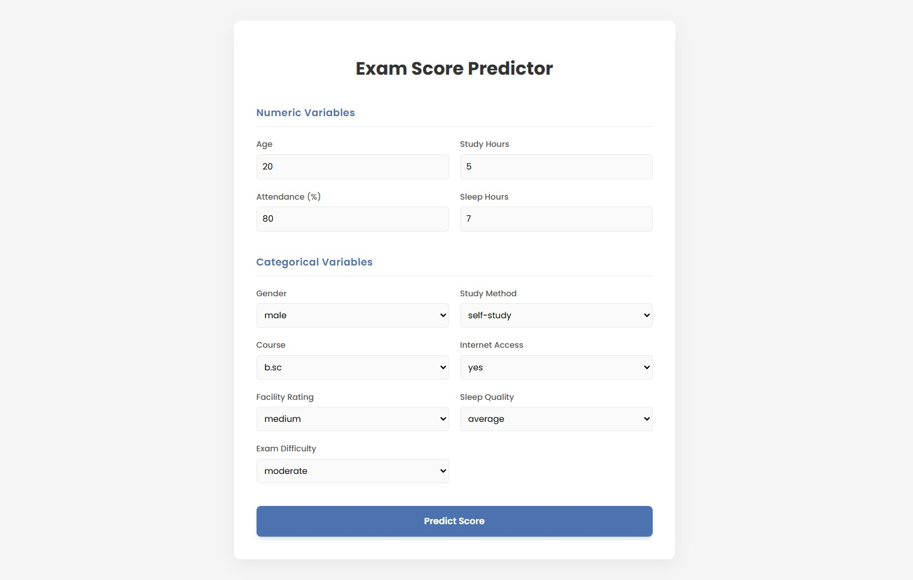
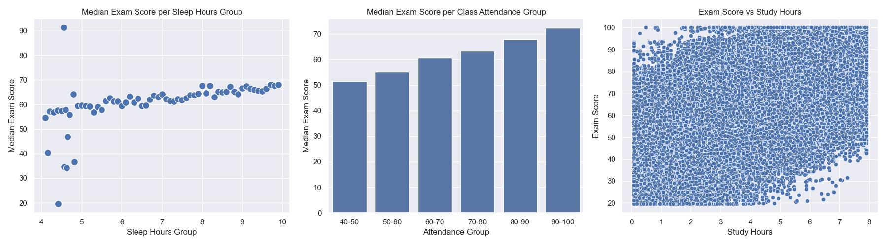
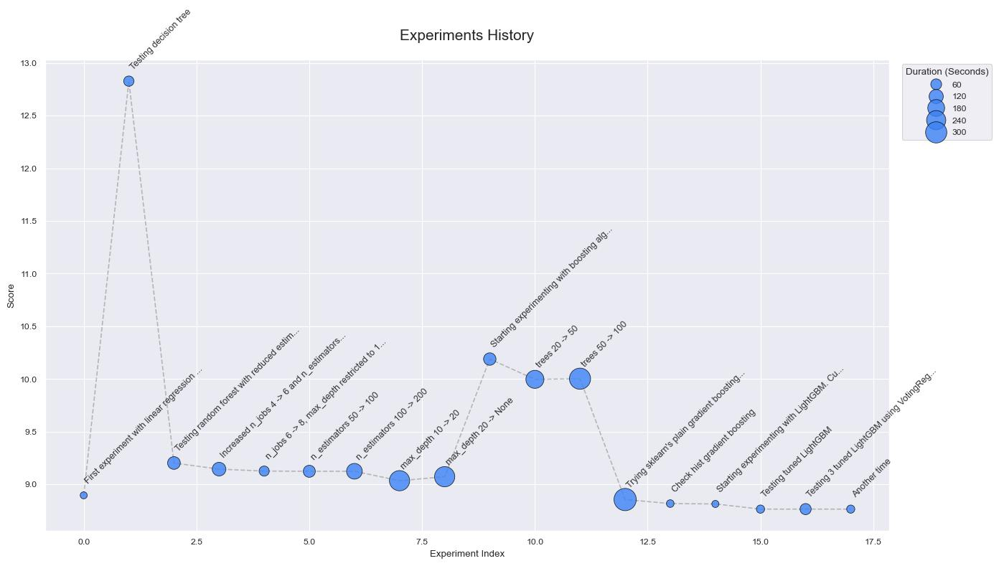

# Student Exam Score Prediction
Project is about prediction of exam scores of students. Idea derives from latest [kaggle competition](https://www.kaggle.com/competitions/playground-series-s6e1/overview). In addition frontend in `React` has been created as well as REST API in `Flask` for simple models usage.


## Preview



## Libraries
Below are presented python packages used for that project:
* `numpy` - handling numerical data
* `pandas` - working with tables
* `sklearn` - machine learning tools
* `lightgbm` - gradient boosting library
* `optuna` - model tuning
* `matplotlib` - the base for plotting
* `seaborn` - more sophisticated, pretty looking graphs
* `flask` - server, api creation


## Project Structure
```txt
├── data/
├── models/
├── images/
├── frontend/
├── notebooks/
│   └── eda.ipynb
├── src/
│   ├── __init__.py
│   ├── preprocessing.py
│   ├── experiment.py
│   ├── tuning.py
│   └── tools.py
├── main.py
├── experiments.md
└── requirements.txt
```

| Component | Description |
| --- | --- |
| `data/` | Directory in which `.csv` files are stored |
| `models/` | Stores models trained from first fold of cross-validation |
| `images/` | Keeps graphs from data analysis and tuning history |
| `frontend/` | Represents web application made in `React` |
| `notebooks/` | Directory with `.ipynb` files for data exploration |
| `eda.ipynb` | Includes exploratory data analysis |
| `src/` | Contains core logic for experiments |
| `preprocessing.py` | Provides data preprocessing column transformer with scaling and encoding |
| `experiment.py` | Enables experimenting with models, saves experiments to `experiments.md` |
| `tuning.py` | Uses `optuna` for specific model tuning |
| `tools.py` | Provides data loading, splitting and other useful methods |
| `main.py` | Core file to start flask server and web application |
| `experiments.md` | Presents whole experiments history |
| `requirements.txt` | Lists libraries required to use this project |


## Configuration
Project has been made using `Python` 3.12.10 and `Node` v22.15.0. Ensure that you also have `npm` installed.

Create Python virtual environment:
```bash
python -m venv venv
```

Then activate it using this command:
```bash
source venv/bin/activate
```

Or if you are on windows paste that:
```bash
./venv/Scripts/activate
```

Ensure to install `requirements.txt` by running the following command:
```bash
pip install -r requirements.txt
```

Go to `frontend/` and then run the command below to get `node_modules` which contains tools need for web app to run:
```
npm install
```

Download `.csv` data from [kaggle](https://www.kaggle.com/competitions/playground-series-s6e1/data). Ensure that it is placed inside `/data` folder.


## Usage
To start using model leveraging via browser just go to the root `/` project directory and run following command:

```python
python main.py --model "model_name.pkl"
```

> Please ensure that this model exists inside `models/` folder.

This will start `Flask` server on port `5000` as well as `Node` server with `React` as frontend library on port `3000`. Now it is ready for usage.

### Own experiments
If you wanted to experiment with your own custom model or given ones with different parameters, you can do it with `experiment.py`. Add your model to `estimators`. Choose proper estimator name and run below command:

```python
python -m src.experiment
```
> Remember about changing `EXP_NUM`, since it will also generate another experiment details inside `experiments.md`

If you wanted to tune your model, go to `tuning.py` and adjust `optuna` study code to align with your model parameters.

## Data Analysis
Firstly I have made some exploratory data analysis to get more familiar with dataset. Data consists of 13 columns, either numerical or categorical. In `eda.ipynb` there are lots of plots showing data distribution and correlations.

Here are a few plots showing relation of some features to the target `exam_score`:


## Preprocessing
Numerical columns have been scaled using sklearn's `StandardScaler` to perform `z = (x - u) / s` on each sample. Categorical columns were divided into ordinal as well as not related to each other, there were used respectively sklearn's `OrdinalEncoder` and `OneHotEncoder`.


## Models
Models tested (chronologically):
* `LinearRegression`
* `DecisionTreeRegressor`
* `RandomForest`
* `AdaBoostRegressor`
* `GradientBoostingRegressor`
* `HistGradientBoostingRegressor`
* `LightGBMRegressor`


## Experiments
There were lots of models used for experiments. Starting from simple linear regression as a **baseline** which turned out to be really good (`~8.8953`) ending on **gradient boosting methods** like `LightGBM`.

Second algorithm tested was `DecisionTreeRegressor` which was worse that `LinearRegression`. It used a few times more time and got lower score. 

Then I switched to more sophicticated structure - `RandomForest`. I put more time on it. It required more time to to cross-validation on it. I went from `~92s` to `~270s` given higher number of trees, but results (`~9.07`) were still worse than our baseline.

After that I started with boosting - `AdaBoost` as a first algorithm was weak - in each case `~10` score with huge amount of time (`87s`, `209s`, `297s`).

Next was `GradientBoostingRegressor` which was the first candidate to be the best. It achieved `8.8554` rmse, but took so long `332.28s`.

Even better results has been provided by `HistGradientBoostingRegressor` - `8.8170` (next best) and only `17.82s`. We now went from `~332` to `~17.82s` and got better performance.

At last `LightGBMRegressor` turned out to perform the best - `8.8135` with `11.85s` (similar time to baseline), so that I decided to put more time on it and leverage `optuna` to find the best parameters and improve it even more.


## Tuning
I wanted to use grid search for tuning parameters of `RandomForest`, but resigned due to RAM problems. Due to the fact that dataset is so big - hunders of thousands samples, this algorithm consumed so much memory.

Fortunately gradient boosting techniques turned out to be better. They consumed less memory, time and achieved better RMSE.

I have been also tuning `LightGBM` regressor for 50 trials. Each consisting of `KFold` cross-validation splitted into 5 folds. This was performed by usage of `optuna` and goal was to minimize RMSE. Best achieved values:

**Score**: `~8.7881`
```python
{
    'lambda_l1': 6.336661658433877, 
    'lambda_l2': 5.713800450906738, 
    'learning_rate': 0.09854420698068374, 
    'max_depth': 8, 
    'num_leaves': 250, 
    'colsample_bytree': 0.670750939608245,
    'colsample_bynode': 0.8685671163349028, 
    'bagging_fraction': 0.8986253939886042, 
    'bagging_freq': 5, 
    'min_data_in_leaf': 77
}
```

**Optimization history**


## Conclusions
There were multiple algorithms tested. Starting from simple linear regression, then testing a couple of ensemble methods - decision trees, random forests, ending on gradient boosting techniques. I went from `8.8953` and `11.18s` baseline (linear regression) to `8.7644` and `23.46s` (lightgbm).
We can deduct from it that even pretty simple algorithms can be so powerful comparing to much more time and resource consuming structures, but in the end the more sophisticated version of boosting won.
Here is the history of experiments:

